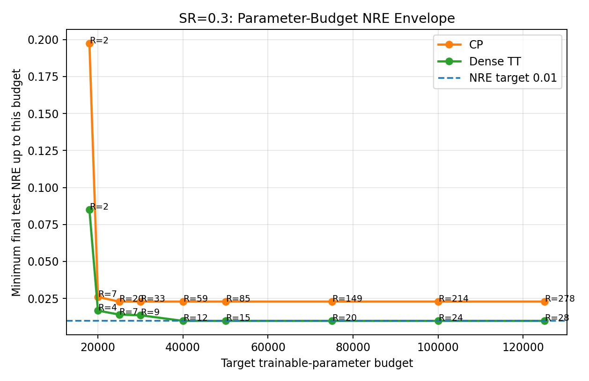
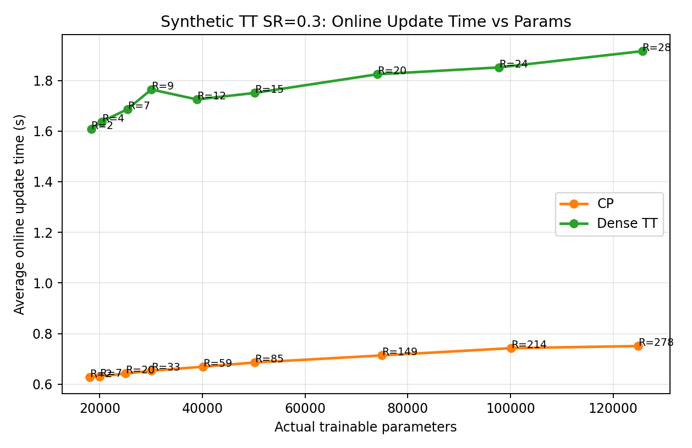

# Experimental Results: Synthetic TT Parameter-Budget Study

To evaluate whether the proposed TT-based online model gives a practical reconstruction advantage, we ran a controlled synthetic experiment in which the ground-truth tensor was generated from the same dense-TT functional form used by the proposed model. The tensor size was `40 x 40 x 50`, with sampling rate `0.3`. We compared the proposed Dense TT model against the CP-based OFTD baseline under matched trainable-parameter budgets.

The experiment follows the online training setup. First, the model is initialized on a small initial snapshot of size `4 x 4 x 5`, corresponding to `10%` of each tensor dimension. During initialization, the INR factor networks are trained on the observed entries of this initial snapshot, with validation-based early stopping. After initialization, the online stage begins. At each online step, the active tensor grows by `+4 x +4 x +5`, until reaching the full tensor size `40 x 40 x 50` after `T = 9` online updates. At the end of training, inference is performed by evaluating the learned INR factor networks over the full coordinate grid and reconstructing the full tensor.

The online update loss uses memory replay in addition to the newest incoming block. At every online update, replay coordinates are sampled from historical indices using a long-tail Beta distribution, `Beta(1.0, 1.2)`, with replay size `I_t / 3` per active dimension. The newest block is always included in the update loss. This means each online step optimizes the model on both recent data and a sampled subset of older coordinates, reducing forgetting while avoiding the cost of retraining on the full history.

The NRE envelope shows that the Dense TT model achieves consistently lower reconstruction error than the CP baseline under comparable trainable-parameter budgets. In particular, Dense TT reaches a final test NRE near `0.01`, while CP remains above this level across the tested budgets. This supports the main hypothesis that the TT parameterization is better matched to this synthetic TT-structured data.

The improved NRE comes with higher online update cost. Across the tested parameter budgets, Dense TT requires roughly `1.6-1.9` seconds per online update, compared with roughly `0.6-0.8` seconds for CP after removing the unnecessary non-trainable CP core contraction. Therefore, the result shows a clear accuracy/time tradeoff: the proposed Dense TT model gives better reconstruction quality on TT-structured data, but it requires more online update time.
